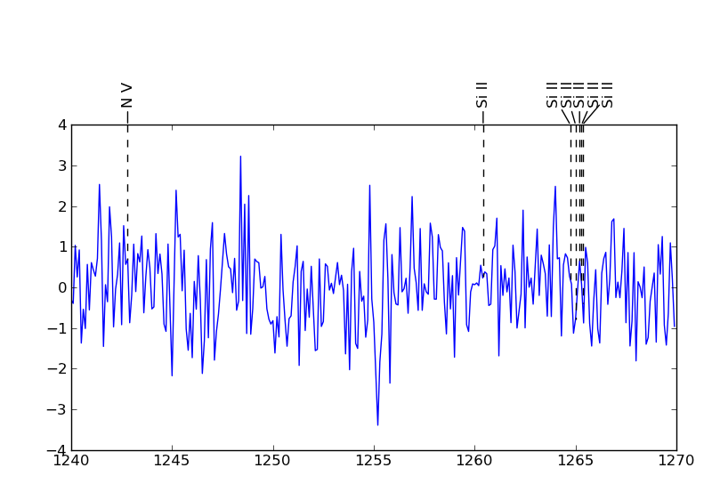
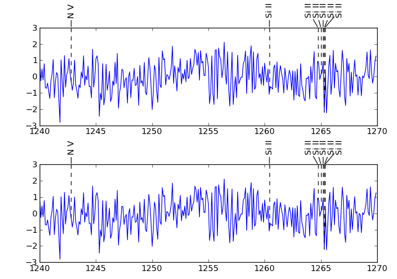

Line identification plots using Matplotlib
==========================================

.. _lineid_plot: http://idlastro.gsfc.nasa.gov/ftp/pro/plot/lineid_plot.pro
.. _IDL Astronomy User's Library: http://idlastro.gsfc.nasa.gov/

Manually labeling features in a crowed plot can be very time
consuming. This module can be used to automatically place labels for
given features in a plot, without the labels overlapping each
other. This is useful, for example, in creating plots of spectrum with
specific lines identified with labels.

The placements are calculated using a simple, iterative algorithm
adapted from the procedure `lineid_plot`_ in the NASA `IDL Astronomy
User's Library`_. Matplotlib makes most of the computations in the
above IDL procedure unnecessary.

The main function in the module is `plot_line_ids()`. Labeled plots can
be created by passing the x and y coordinates, for example wavelength
and flux, along with the x coordinates of the features and their
labels.

This function will return the Figure and Axes used. Additional
customizations, such as manual adjustments to positions, can be carried
out using these references.

Examples
========

Code given below creates the following plot:

::

   >>> import numpy as np
   >>> from matplotlib import pyplot as plt
   >>> import lineid_plot

   >>> wave = 1240 + np.arange(300) * 0.1
   >>> flux = np.random.normal(size=300)

   >>> line_wave = [1242.80, 1260.42, 1264.74, 1265.00, 1265.2, 1265.3, 1265.35]
   >>> line_label1 = ['N V', 'Si II', 'Si II', 'Si II', 'Si II', 'Si II', 'Si II']

   >>> plot_line_ids(wave, flux, line_wave, line_label1)
   >>> plt.show()

The `plot_line_ids()` function also accepts an Axes or a Figure in
which to create the labels. The is useful in situations where we
already have an Axes. For example, we may have multiple Axes in a
Figure, and we want to add labels to one or more of these Axes.

Code given below creates two Axes in a Figure, and plots data and
labels in both of them. The result is:

::

  >>> import numpy as np
  >>> from matplotlib import pyplot as plt
  >>> import lineid_plot
   
  >>> wave = 1240 + np.arange(300) * 0.1
  >>> flux = np.random.normal(size=300)
  >>> line_wave = [1242.80, 1260.42, 1264.74, 1265.00, 1265.2, 1265.3, 1265.35]
  >>> line_flux = np.interp(line_wave, wave, flux)
  >>> line_label1 = ['N V', 'Si II', 'Si II', 'Si II', 'Si II', 'Si II', 'Si II']
  >>> label1_sizes = np.array([12, 12, 12, 12, 12, 12, 12])
   
  >>> fig = plt.figure(1)
  
  >>> ax = fig.add_axes([0.1,0.06, 0.85, 0.35])
  >>> ax.plot(wave, flux)
  >>> lineid_plot.plot_line_ids(wave, flux, line_wave, line_label1, ax=ax)
  >>> ax1 = fig.add_axes([0.1, 0.55, 0.85, 0.35])
  >>> ax1.plot(wave, flux)
  >>> lineid_plot.plot_line_ids(wave, flux, line_wave, line_label1, ax=ax1)

..  LocalWords:  lineid IDL idlastro gsfc nasa
